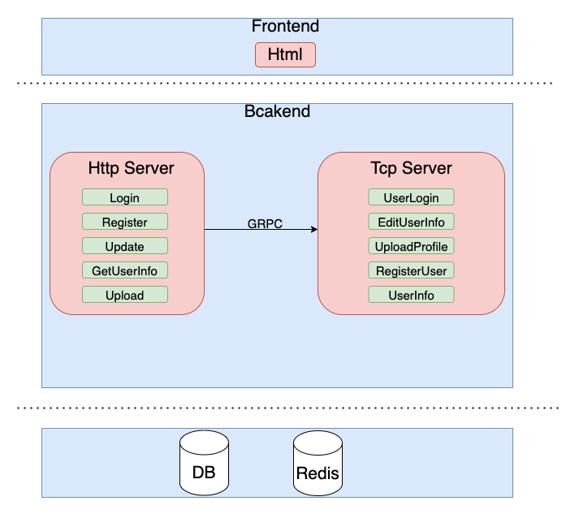
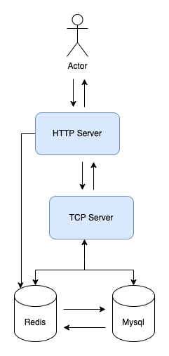
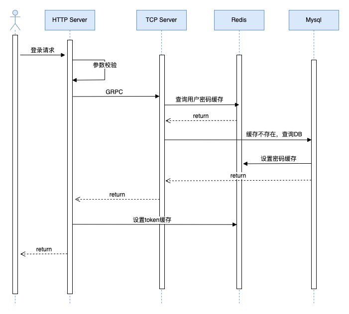
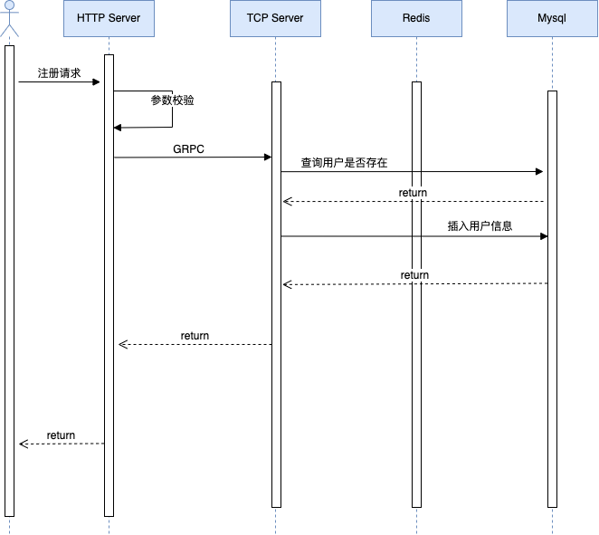
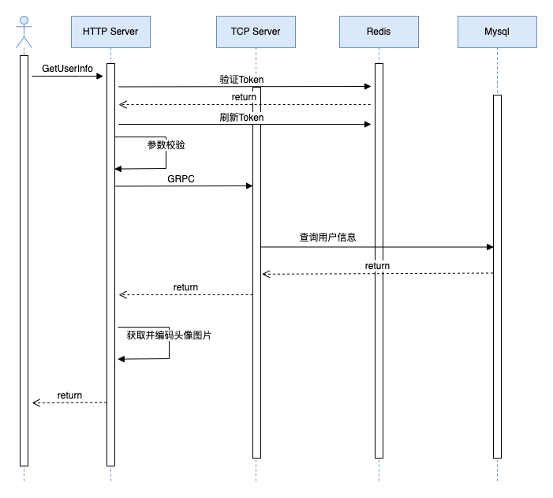
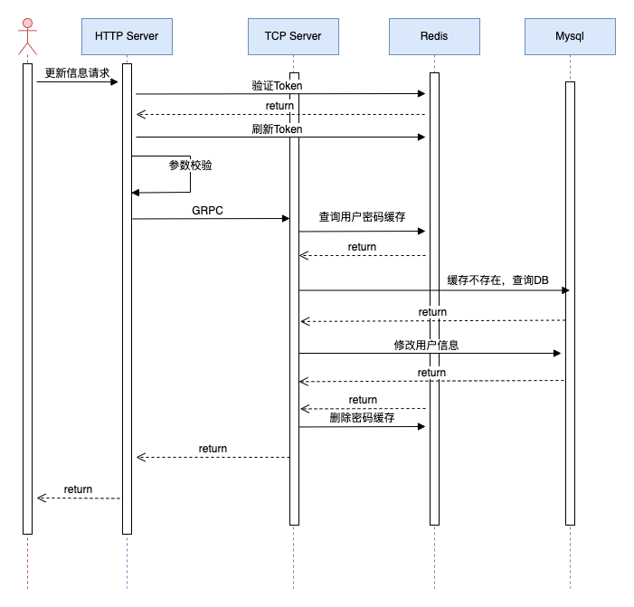
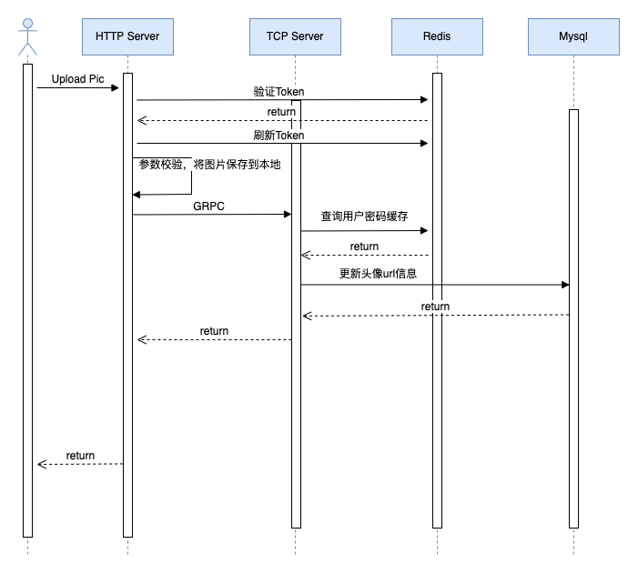
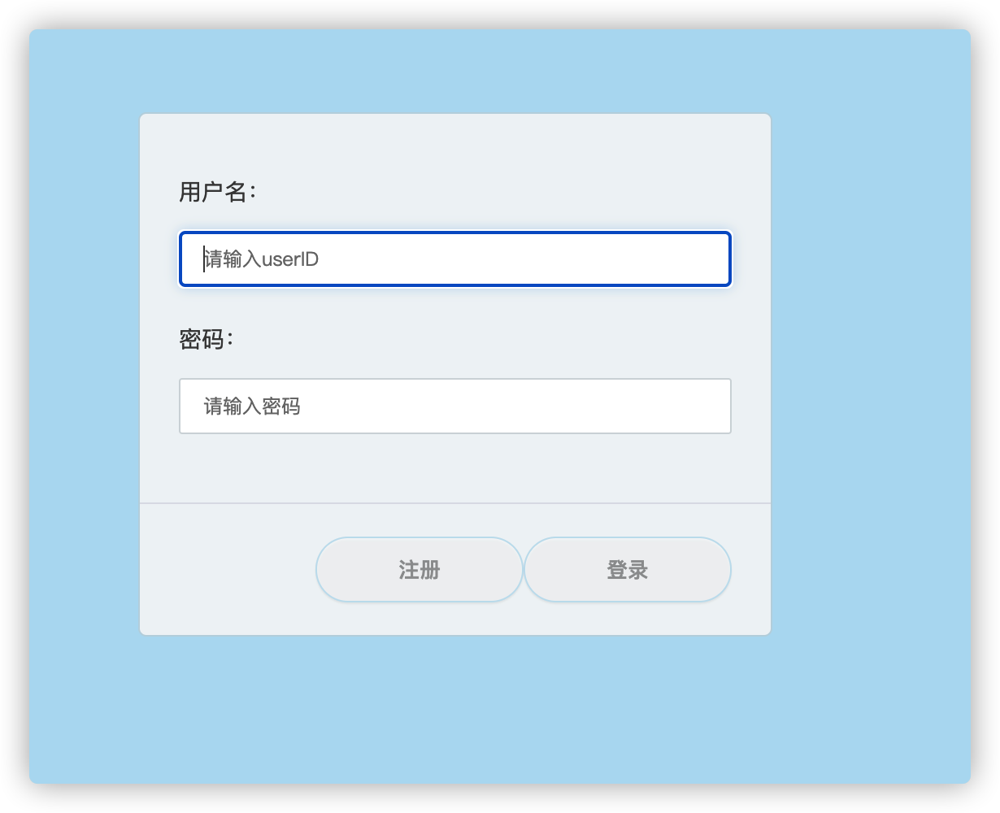
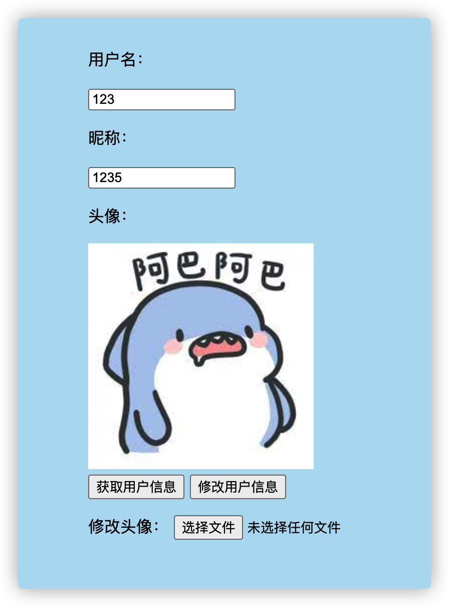
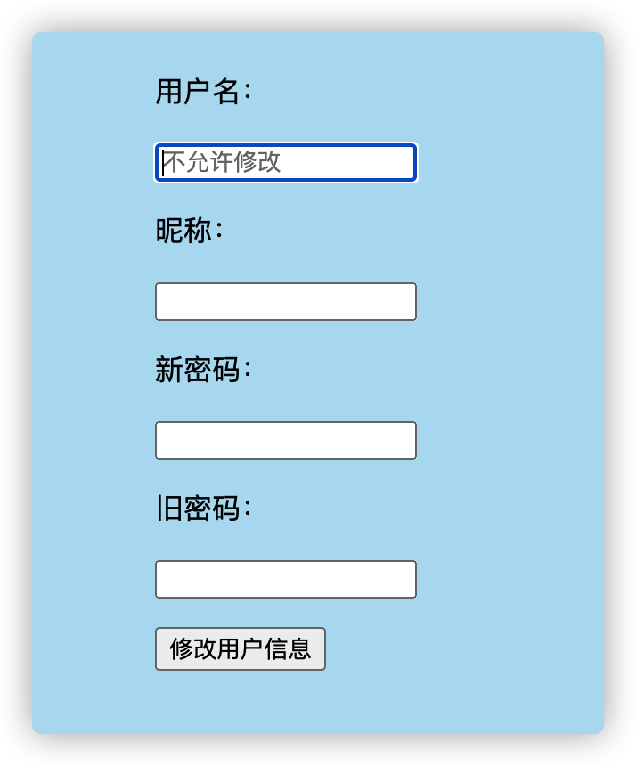

---

---

# http_server-tcp_server

[TOC]

## 总体结构



本任务实现一个用户管理系统，用户可以登录、拉取和编辑他们的信息

## 技术概要

| 功能       | 技术框架 |
| :--------- | :------- |
| 鉴权       | go-jwt   |
| 配置       | go-ini   |
| 缓存       | Redis    |
| 测试       | jmeter   |
| 日志       | Zap      |
| 数据库     | Mysql    |
| 图片编码   | base64   |
| 前端       | Html     |
| TCP服务器  | Grpc     |
| Http服务器 | gin      |

## HTTP API接口

API：

| api       | method | 功能         | 参数                                                         | 返回                                             | header |
| :-------- | :----- | :----------- | :----------------------------------------------------------- | :----------------------------------------------- | ------ |
| /login    | post   | 用户登陆     | username:""<br />password:""                                 | status:int<br />msg:""                           |        |
| /register | post   | 用户注册     | username:""<br />password:""<br />nickname:""                | status:int<br />msg:""                           |        |
| /update   | post   | 更新用户信息 | username:可传可不传，后端不使用<br />old_password:""<br />new_password:""<br />nickname:"" | status:int<br />msg:""                           | token  |
| /profile  | get    | 获取用户信息 | usename=""                                                   | UserId:<br />NickName:""<br /> ProfilePicture:"" | token  |
| /upload   | post   | 上传头像     | (form-data)image                                             | status:int<br />msg:""                           | token  |

web 页面：

| api             | method | 功能             | 参数 |
| :-------------- | :----- | :--------------- | :--- |
| `/`             | get    | 前端首页         |      |
| `/userRegister` | get    | 注册页面         |      |
| `/userinfo`     | get    | 用户信息页面     |      |
| `/updateUser`   | get    | 用户信息修改界面 |      |

## RPC server

基于grpc和protobuf

```
syntax             = "proto3";
option  go_package = "/proto";
package admin_service;

service adminService
{
    rpc UserInfo(UserInfoReq) returns (UserInfoRsp);
    rpc EditUserInfo(UserEditReq) returns (UserEditRsp);
    rpc UploadProfile(UploadProfileReq) returns (UploadProfileRsp);
    rpc UserLogin(UserLoginReq) returns (UserLoginRsp);
    rpc RegisterUser(RegisterUserReq) returns (RegisterUserRsp);
}
message UserInfoReq
{
    string UserId = 1;
}
message UserInfoRsp
{
    string UserId         = 1;
    string NickName       = 2;
    string ProfilePicture = 3;
}
message UserLoginReq
{
    string UserId   = 1;
    string Password = 2;
}
message UserLoginRsp
{
    bool   status = 1;
    string msg    = 2;
}

message UserEditReq
{
    string UserId      = 1;
    string NewPassword = 2;
    string OldPassword = 3;
    string NickName    = 4;
}

message UserEditRsp
{
    bool   status = 1;
    string msg    = 2;
}
message UploadProfileReq
{
    string UserId = 1;
    string Url    = 2;
}

message UploadProfileRsp
{
    bool   status = 1;
    string msg    = 2;
}

message RegisterUserReq
{
    string UserId   = 1;
    string Password = 2;
    string NickName = 3;
}

message RegisterUserRsp
{
    bool   status = 1;
    string msg    = 2;
}
```

## 库表设计

功能较单一简单，只需要一张user_info_tab

```sql
CREATE TABLE `user_info_tab` (
  `id` bigint(20) unsigned NOT NULL AUTO_INCREMENT COMMENT 'primary key',
  `user_id` varchar(50) COLLATE utf8mb4_unicode_ci NOT NULL DEFAULT ''  COMMENT 'user_id',
  `password` varchar(50) COLLATE utf8mb4_unicode_ci NOT NULL DEFAULT ''  COMMENT 'password',
  `nickname` varchar(10)  COLLATE utf8mb4_unicode_ci NOT NULL DEFAULT ''   COMMENT 'nickname',
  `profile_picture` varchar(50) COLLATE utf8mb4_unicode_ci NOT NULL DEFAULT '' COMMENT 'profile picture name', 
  `create_timestamp` bigint(20) unsigned NOT NULL DEFAULT '0' COMMENT 'create timestamp',
  `update_timestamp` bigint(20) unsigned NOT NULL DEFAULT '0' COMMENT 'update timestamp',
 	PRIMARY KEY (`id`),  
	KEY `idx_user_id` (`user_id`) USING BTREE
) ENGINE=InnoDB DEFAULT CHARSET=utf8mb4 COLLATE=utf8mb4_unicode_ci;
```

假设用户较多，做十张分表，代码实现种简单利用userid%10决定分表的逻辑

```sql
CREATE TABLE `user_info_tab_00000001` LIKE `user_info_tab_00000000`;
CREATE TABLE `user_info_tab_00000002` LIKE `user_info_tab_00000000`;
CREATE TABLE `user_info_tab_00000003` LIKE `user_info_tab_00000000`;
CREATE TABLE `user_info_tab_00000004` LIKE `user_info_tab_00000000`;
CREATE TABLE `user_info_tab_00000005` LIKE `user_info_tab_00000000`;
CREATE TABLE `user_info_tab_00000006` LIKE `user_info_tab_00000000`;
CREATE TABLE `user_info_tab_00000007` LIKE `user_info_tab_00000000`;
CREATE TABLE `user_info_tab_00000008` LIKE `user_info_tab_00000000`;
CREATE TABLE `user_info_tab_00000009` LIKE `user_info_tab_00000000`;
```


## 系统流程



- 登录

  

- 注册

  

- 获取用户信息

  

- 更新用户信息

  

- 上传头像

  


## 项目展示

* 登录界面



* 注册界面


* 用户信息界面



* 信息修改



## TODO

* rpc server的model层为手动构造，可以利用xorm自动生成库表对应的结构体，防止出现bug
* 可以部署主从同步数据库，读写分离，提高系统鲁棒性
* 用户登出等逻辑还没加入
* 可以考虑使用wrt等压测工具对项目进行压测